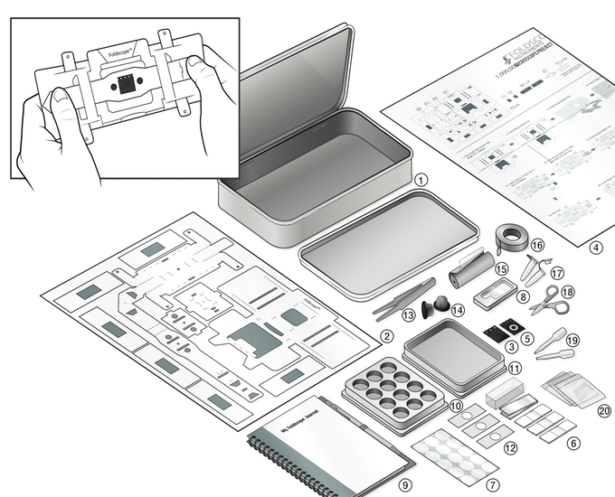
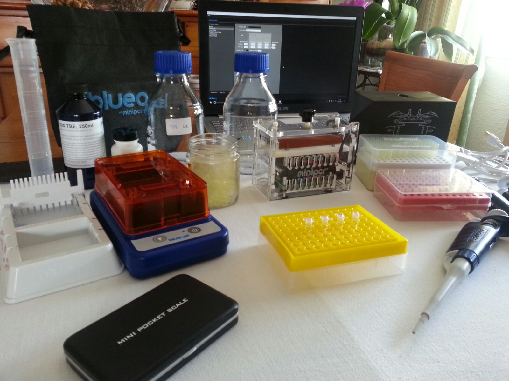

# Bio Hacking

# El reto no era hacer un Lab, el reto es como hacer que cada Escuela tenga un Lab

## Interés por la genética

[23&me](https://www.23andme.com/)

## Interés por la glucosa

[¿Está apple trabajando en la medida de glucosa?](
https://www.enriquedans.com/2017/05/es-la-glucemia-el-proximo-indicador-a-monitorizar.html)

[Open Insulin](https://makezine.com/2017/03/16/open-insulin-project-aims-disrupt-diabetes/)

[Extract your ADN](https://www.instructables.com/id/5-minute-DNA-Extraction-in-a-Shot-Glass/)

## ¿Qué quiero conseguir?

## ¿Qué se entiende por Bio Hacking?

## ¿Qué hace falta?

## Proyectos

### [FoldScope](https://www.foldscope.com/what-we-do/)

### [Herramientas de Laboratorio imprimibles](https://www.thingiverse.com/javacasm/collections/laboratorio)

## Comunidades

### [GaudiLabs](http://www.gaudi.ch/GaudiLabs/)

[9 proyectos de BioHacking](http://makezine.com/2017/03/23/biohacking-projects/)

### [Hackteria](https://www.hackteria.org/category/projects/)

## Equipos

[CNC para Hacking agricultura ](http://makezine.com/2017/04/27/community-creating-solution-farmbot-technology/)

[Centrifugadora sencilla](http://makezine.com/projects/3d-printed-centrifuge/)

[MiniPCR](http://www.minipcr.com/) (multiplicador de ADN, Termociclador)

[Laboratorio en un maletin](http://2016.igem.org/Team:Valencia_UPV/Hardware)

[Open science hardware](http://openhardware.science/2016/09/29/gosh-thats-handy-open-science-hardware/)

## Recursos

[BioTecnoEncuentro](http://www.biotecnoencuentro.com/informacion-2/)

### Redes sociales

@OpenLabMadrid
@DIYBIOBCN ‏
@OpenBioPrinting
@BioHackingITM
